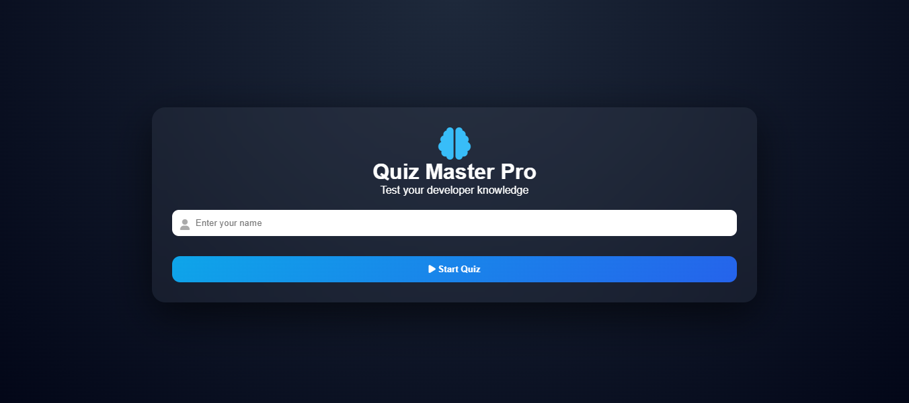

#  Quiz Master Pro

<p align="center">
  
</p>

<p align="center">
  A modern and interactive quiz web application built with <strong>HTML5</strong>, <strong>CSS3</strong>, and <strong>Vanilla JavaScript</strong>.  
  Challenge your developer knowledge through multiple categories with real-time scoring, countdown timers, and a polished responsive interface.
</p>

<p align="center">
  <a href="https://quiz-master-pro-pied.vercel.app" target="_blank">
    
  </a>
  <a href="#">
    
  </a>
</p>

---

##  Overview

Quiz Master Pro is a lightweight front-end quiz platform designed to deliver an engaging learning experience.
Users can enter their name, choose a category, answer timed questions, and receive a final performance evaluation instantly.

---

##  Core Features

* User login system
* Multiple quiz categories
* 15-second countdown timer per question
* Dynamic progress bar
* Instant answer feedback
* Previous & next navigation controls
* Final score summary
* Performance rating system
* Fully responsive design
* Modern glassmorphism interface

---

##  Categories Included

* Web Development
* JavaScript
* Python

---

##  Tech Stack

| Technology   | Purpose                     |
| ------------ | --------------------------- |
| HTML5        | Page Structure              |
| CSS3         | Styling & Responsive Layout |
| JavaScript   | Quiz Logic & Interactivity  |
| Font Awesome | Icons                       |

---

##  Live Demo

<p align="center">
  <a href="https://quiz-master-pro-pied.vercel.app" target="_blank">
    
  </a>
</p>

---

##  Local Setup

```bash id="9gh51"
git clone https://github.com/your-username/quiz-master-pro.git
cd quiz-master-pro
```

Then open `index.html` in your browser.

---

##  Author

**Lee Simoyi**

---

<p align="center">
  If you found this project useful, consider giving it a ⭐ on GitHub.
</p>
